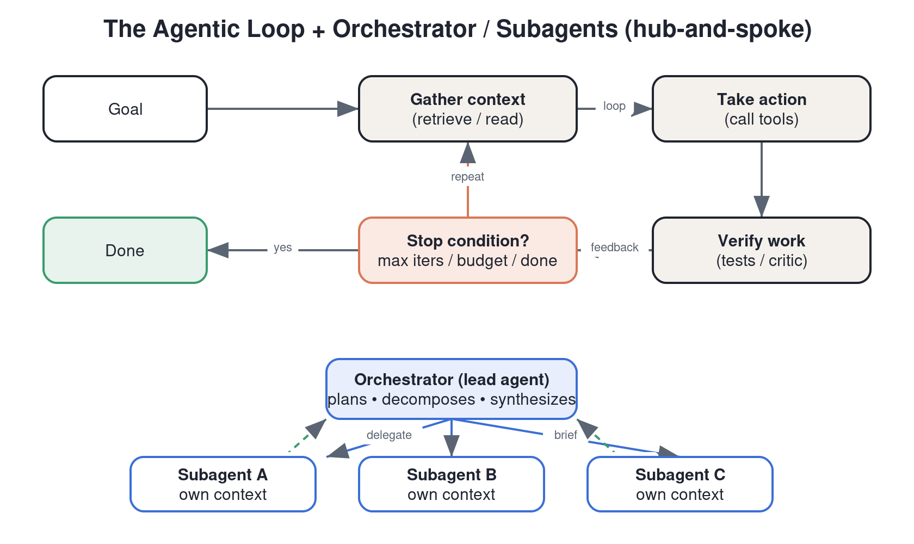

# Domain 1 — Agentic Architecture & Orchestration (~27%)

> The biggest domain, because agent design is where production systems break. Tests your judgment on building reliable single- and multi-agent systems with Claude.
> Content here is grounded in Anthropic's published guidance ("Building effective agents," the Claude Agent SDK docs, and multi-agent research engineering posts). Exam blueprint is `[COMMUNITY]`.

---

## 1. Agents vs. workflows — the foundational distinction

Anthropic draws a sharp line:

- **Workflows** orchestrate LLMs and tools through **predefined code paths**. The control flow is fixed; you wrote it.
- **Agents** let the **LLM dynamically direct its own process** — deciding which tools to use and when, in a loop, until a goal is met.

**The single most important design principle: find the simplest solution that works, and only increase complexity when it demonstrably improves outcomes.** Many problems need just a single well-prompted LLM call with retrieval and good examples — not an agent. Agents trade latency, cost, and unpredictability for flexibility on open-ended tasks.

**Use a workflow when** the steps are known and fixed (predictability, lower cost). **Use an agent when** the path can't be predicted in advance, the task is open-ended, and you need the model to adapt.

### Common workflow patterns (know these by name)

- **Prompt chaining** — decompose into fixed sequential steps; each call's output feeds the next. Add programmatic "gates" between steps. Best when a task cleanly splits into subtasks.
- **Routing** — classify the input, then send it to a specialized prompt/model. Best when categories are distinct and handled better separately (e.g., cheap model for easy queries, strong model for hard ones).
- **Parallelization** — run subtasks at once and aggregate. Two flavors: **sectioning** (split into independent subtasks) and **voting** (run the same task several times for diverse outputs / higher confidence).
- **Orchestrator–workers** — a central LLM dynamically breaks down a task and delegates to worker LLMs, then synthesizes. Differs from parallelization because subtasks aren't predefined — the orchestrator decides them.
- **Evaluator–optimizer** — one LLM generates, another evaluates and gives feedback, loop until good enough. Best when you have clear eval criteria and iteration measurably helps.

## 2. The agentic loop

An agent runs a loop: **gather context → take action (call tools) → verify work → repeat** until done. Concretely the model: receives a goal → plans → calls a tool → reads the tool result that you feed back into the conversation → decides the next action → … → stops when the goal is met or a stop condition triggers.

Three capabilities make agents work (the Agent SDK frames it this way):

1. **Gather context** — pull in the right information (via tool calls, retrieval, files) *just in time*, not all up front.
2. **Take action** — call tools to affect the world.
3. **Verify work** — check results (tests, validators, a critic step) before declaring success.

You must design **stop conditions** (goal reached, max iterations, budget/turn cap, explicit "done" tool) or an agent can loop indefinitely or burn budget.

## 3. Single-agent vs. multi-agent

**Default to a single agent with good tools.** Reach for multi-agent only when the task benefits from **parallel exploration** or **separation of concerns** that one context window can't handle well.

**When multi-agent helps** (per Anthropic's multi-agent research system write-up): tasks that are **broad, open-ended, and parallelizable** — e.g., research that requires exploring many independent directions at once. Multiple subagents each work in their **own context window**, exploring different aspects simultaneously, then a lead agent synthesizes. This buys you more *effective* context and parallel breadth.

**The costs of multi-agent:** it burns **far more tokens** (Anthropic reported multi-agent systems can use ~15× the tokens of a single chat), adds coordination complexity, and risks subagents duplicating work or conflicting. Don't use it for tasks that are mostly sequential or that need tight shared state.

### Orchestrator (lead) / subagent (worker) pattern — "hub and spoke"

- A **lead/orchestrator agent** plans, decomposes the task, and spawns subagents with **clear, specific objectives**.
- Each **subagent** has a focused task, its own context, its own tools, and returns a condensed result.
- The lead **synthesizes** subagent outputs into the final answer.
- **Critical design rule:** give each subagent a *detailed task description* (objective, output format, tools to use, boundaries). Vague delegation is the #1 multi-agent failure mode — subagents duplicate work or drift.

## 4. Task decomposition & delegation

- Break large tasks into subtasks with **explicit, non-overlapping scopes**.
- Tell each subagent **how much effort to spend** (scale effort to query complexity) to avoid runaway token use.
- Decide **how results come back** (structured summaries, not raw dumps) so the orchestrator's context stays clean.

## 5. Memory & state across long tasks

- **Context is finite.** For long-running agents, persist state **outside** the context window (files, a scratchpad, external memory) and reload **just in time**.
- **Session resumption:** design agents so a session can be paused/resumed — persist the plan and intermediate artifacts so a crash or context reset doesn't lose work.
- Use **compaction/summarization** when the conversation grows: summarize older turns into a compact form and keep going (see Domain 4).

## 6. Reliability patterns for agents

- **Verification step**: have the agent (or a separate critic) check its own work — run tests, validate against a schema, or use an evaluator agent.
- **Guardrails**: constrain tool permissions, validate tool inputs/outputs, and add human-in-the-loop checkpoints for high-stakes actions.
- **Error handling**: feed tool errors back to the model so it can recover, but cap retries.
- **Observability**: log the agent's decisions/tool calls so you can debug non-deterministic behavior.

## 7. Hooks vs. prompts (decision framework) `[COMMUNITY emphasis]`

When you need to *guarantee* a behavior, don't ask the model nicely — enforce it in code. Community blueprints stress a **hooks-vs-prompts** decision:

- **Prompt/instruction** → for *soft* guidance the model should usually follow (style, preferences, heuristics). Cheap, flexible, not guaranteed.
- **Hook / deterministic code** → for *hard* requirements that must always happen (e.g., "always run the linter before commit," "block writes outside this dir," redaction of secrets). Hooks fire deterministically regardless of what the model "decides." (Claude Code formalizes hooks — see Domain 5.)
- Rule of thumb: **if a violation is unacceptable, make it a hook, not a prompt line.**

---

## Self-test (close the notes, answer aloud)

1. Give two concrete signals that a task should be a **workflow**, not an agent.
2. Name all five workflow patterns and the one situation each is best for.
3. What are the three capabilities of the agentic loop, and what's a stop condition?
4. When is multi-agent worth ~15× the token cost — and when is it the wrong call?
5. What's the #1 failure mode of subagent delegation, and how do you prevent it?
6. You must guarantee secrets are never written to disk by an agent. Prompt, or hook? Why?

## Teach-it-back checklist

- [ ] I can explain "simplest thing that works" and why agents add cost/risk.
- [ ] I can draw the orchestrator–worker (hub-and-spoke) pattern and say why each subagent needs its own context + a detailed brief.
- [ ] I can explain how long-running agents survive a context reset (external state + session resumption).
- [ ] I can articulate the hooks-vs-prompts rule in one sentence.

## Sources

- Anthropic — *Building effective agents*: https://www.anthropic.com/engineering/building-effective-agents
- Anthropic — *How we built our multi-agent research system*: https://www.anthropic.com/engineering/multi-agent-research-system
- Anthropic — *Building agents with the Claude Agent SDK*: https://www.anthropic.com/engineering/building-agents-with-the-claude-agent-sdk
- Claude docs — Agent SDK / tool use: https://platform.claude.com/docs
