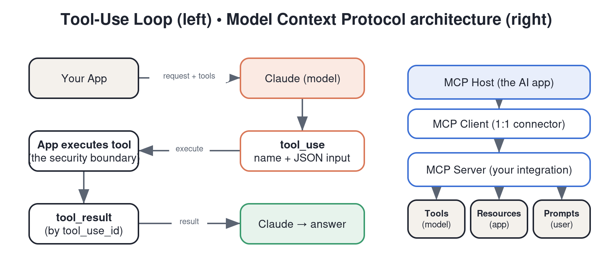

# Domain 3 — Tool Design & MCP Integration (~18%)

> Tests whether you can design tools and wire up Model Context Protocol so Claude uses them **reliably**. Grounded in Anthropic's tool-use docs, MCP spec, and "writing tools for agents" guidance. Weighting is `[COMMUNITY]`.

---

## 1. How tool use (function calling) works
The request/response loop for a single tool call:
1. You send a message **plus a list of tool definitions** (each: `name`, `description`, `input_schema` in JSON Schema).
2. Claude decides whether to use a tool. If yes, it returns a `tool_use` block with the chosen tool's name and JSON `input`, and `stop_reason: "tool_use"`.
3. **Your code** executes the tool and sends the result back as a `tool_result` block (referencing the `tool_use_id`).
4. Claude uses the result to produce its next message (or another tool call).

Key points:
- **The model never runs your tool** — it only emits the intent; you execute and return the result. (This is the security boundary.)
- Tools can be forced/limited via **`tool_choice`** (`auto`, `any`, a specific tool, or `none`).
- Tool definitions and results consume tokens and sit in context.

## 2. What makes a *good* tool (this is the heart of the domain)
From Anthropic's "writing tools for agents" guidance:
- **Clear, descriptive names** — `get_weather`, not `gw`.
- **Rich descriptions** — the description is a *prompt*. Explain what the tool does, when to use it (and when not), units, side effects, and edge cases. Most tool-use failures are under-specified descriptions.
- **Well-typed `input_schema`** — use JSON Schema with types, `enum`s for fixed choices, `required` fields, and per-field descriptions. Constrain inputs so the model can't pass garbage.
- **Few, well-chosen tools** beat many overlapping ones. Overlapping/ambiguous tools cause the model to pick wrong. Consolidate.
- **Return useful, concise results** — return what the model needs to act, not a giant dump. Token-efficient results matter; consider pagination/filtering and returning IDs the model can drill into.
- **Make tools agent-ergonomic** — design for how the model will actually chain them; return errors that tell the model how to fix the call.
- **Handle errors gracefully** — return a structured error the model can recover from rather than throwing.

## 3. Tool use for structured output
A tool whose `input_schema` equals your desired output schema, forced via `tool_choice`, is the most reliable way to extract structured JSON (cross-reference Domain 2 §6).

## 4. Model Context Protocol (MCP) — the big topic
**MCP is an open standard for connecting AI applications to external systems** — "a USB-C port for AI": one standard way to plug tools, data, and prompts into any MCP-aware client (Claude apps, Claude Code, the API via connectors, third-party hosts).

### Architecture
- **MCP host** — the AI app the user interacts with (e.g., Claude Desktop, Claude Code).
- **MCP client** — lives inside the host; maintains a 1:1 connection to a server.
- **MCP server** — a program exposing capabilities (your integration). Can be **local** (stdio transport) or **remote** (HTTP/SSE transport).

### The three core server primitives (memorize these)
| Primitive | Who controls it | What it is |
|-----------|-----------------|-----------|
| **Tools** | **Model-controlled** | Functions the model can call to take actions (like function calling above). |
| **Resources** | **Application-controlled** | Read-only data/context the app can load (files, DB rows, docs) identified by URI. |
| **Prompts** | **User-controlled** | Reusable prompt templates/workflows the user can invoke (e.g., a slash command). |

(Advanced primitives you should recognize: **sampling** — server asks the host's LLM to generate; **roots** — filesystem scoping; **elicitation** — server asks the user for input; **notifications** — server pushes updates.)

### Why MCP vs. raw function calling
- **Reusability/interoperability:** write one MCP server, use it across any MCP-compatible client. Raw tool definitions are tied to your single app.
- **Separation of concerns:** the integration (server) is decoupled from the app (host).
- **Ecosystem:** prebuilt servers for common systems; standard auth and transport.
- **When you DON'T need MCP:** if it's a single app with a few bespoke tools, plain tool use may be simpler. MCP shines when you want portability and reuse. `[COMMUNITY nuance — see "What if you don't need MCP at all?"]`

### Building servers (conceptually, per "Intro to MCP")
- Define **tools** (with schemas + handlers), **resources** (URIs + read handlers), and **prompts** (templates).
- Pick a **transport**: stdio for local, streamable HTTP/SSE for remote.
- **Security:** servers run with real privileges — validate inputs, scope permissions (roots), require auth on remote servers, and never expose secrets. Treat tool inputs as untrusted.

## 5. Tool-use design patterns for production
- **Parallel tool calls:** the model can request several tools at once; design tools to be independent where possible.
- **Idempotency & safety:** mark destructive actions; gate them behind confirmation/human-in-the-loop.
- **Token budgeting:** large tool catalogs and verbose results eat context — prune and summarize.
- **Observability:** log every `tool_use`/`tool_result` for debugging non-determinism.

---

## Self-test (close the notes)
1. Walk through the 4-step tool-use loop. Who actually executes the tool?
2. Name four properties of a well-designed tool. Which one most often causes failures when neglected?
3. List MCP's three core primitives and who controls each (model / app / user).
4. Host vs. client vs. server — define each.
5. Give one reason to use MCP over raw tool definitions, and one situation where raw tools are fine.
6. Name two security practices for an MCP server.

## Teach-it-back checklist
- [ ] I can explain why "the description is a prompt" and give a before/after.
- [ ] I can draw host → client → server and place tools/resources/prompts.
- [ ] I can explain the model-controlled vs. app-controlled vs. user-controlled distinction.

## Sources
- Anthropic docs — *Tool use overview* & *Implement tool use*: https://platform.claude.com/docs (Build with Claude → Tool use)
- Anthropic — *Writing effective tools for agents*: https://www.anthropic.com/engineering (tools-for-agents guidance)
- Model Context Protocol — official docs/spec: https://modelcontextprotocol.io
- Anthropic Academy — *Introduction to Model Context Protocol* (+ *Advanced Topics*): https://anthropic.skilljar.com/introduction-to-model-context-protocol

## Further reading (from Noah's Reader library)
- *What if you don't need MCP at all?* — mariozechner.at (counterpoint on when MCP is overkill)
- *How to Build an Agent* — ampcode.com (hands-on tool-loop walkthrough)
