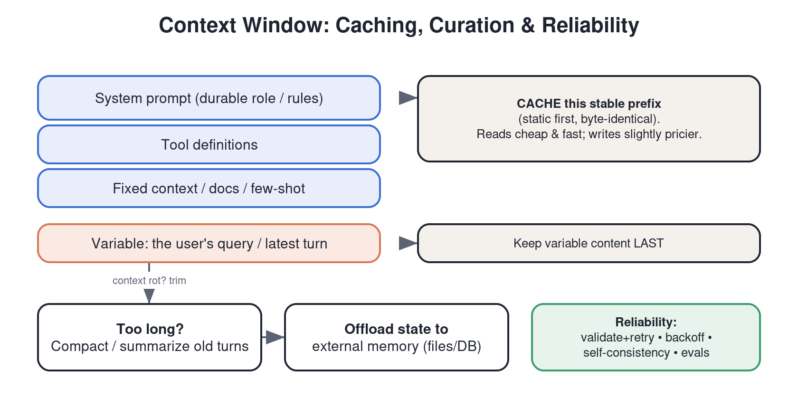

# Domain 4 — Context & Reliability (~15%)

> Tests whether you can manage the context window and make Claude systems **production-grade**: caching, long conversations, latency/cost, and robustness. Grounded in Anthropic's context-engineering, prompt-caching, and model docs. Weighting is `[COMMUNITY]`.

---

## 1. Context engineering (the modern framing)
"Prompt engineering" is about writing the instruction; **context engineering** is about curating *the entire set of tokens* in the window — system prompt, tools, examples, retrieved docs, history — so the model has **the right information, in the right form, at the right time**, and nothing that wastes its limited attention.

Core ideas:
- **The context window is a finite, scarce resource.** More tokens ≠ better; irrelevant context degrades performance ("context rot" / attention dilution).
- **Just-in-time retrieval:** load information when needed (via tools/retrieval) instead of stuffing everything up front.
- **Curate aggressively:** include the minimal high-signal set. Remove stale, redundant, or low-value tokens.
- **Structure for attention:** put durable instructions in the system prompt; clearly delimit sections; keep the most important guidance prominent.

## 2. The context window — mechanics
- The window is the model's working memory: input + output tokens must fit within the model's limit.
- Everything counts against it: system prompt, tool definitions, conversation history, tool results, files.
- When you approach the limit you must **truncate, summarize/compact, or offload** to external storage.

## 3. Managing long conversations & long-running agents
- **Compaction / summarization:** periodically summarize older turns into a compact representation and continue. Preserve decisions, open tasks, and key facts; drop verbatim chatter.
- **External memory:** persist state to files/DB and reload relevant pieces on demand (cross-ref Domain 1 memory).
- **Sub-agent context isolation:** spin off subagents with their own windows for big subtasks, returning only condensed results (cross-ref multi-agent).
- **Structured note-taking / scratchpads:** have the agent write a plan/notes to a file it can re-read, surviving context resets.

## 4. Prompt caching (high-value, frequently tested)
Prompt caching lets you **cache a stable prefix** of the prompt so repeated requests reuse it instead of reprocessing — big **latency and cost** wins.
- **How:** mark a cache breakpoint (`cache_control`) after the stable portion (system prompt, tool defs, big context/docs, few-shot examples). Subsequent calls that share that exact prefix hit the cache.
- **Order matters:** put **static content first** (system, tools, fixed context), **variable content last** (the user's specific query). Anything before the breakpoint must be byte-identical to hit.
- **Economics:** a cache *write* costs a bit more than a normal token; cache *reads* are much cheaper (and faster). Worth it when the same prefix is reused many times (agents, chat, doc Q&A over the same doc).
- **TTL:** cache entries expire after a short window (commonly ~5 minutes, refreshed on use); there are longer-TTL options. Don't rely on it persisting for hours.
- This is "everything" for agent loops: an agent reuses a large stable system/tool prefix every turn — caching slashes cost and latency.

## 5. Latency, cost & model selection
- **Pick the right model for the job:** a smaller/faster model (Haiku-class) for classification/routing/simple tasks; a stronger model (Sonnet/Opus-class) for hard reasoning. Route between them (Domain 1 routing pattern).
- **Reduce tokens:** trim context, cache prefixes, cap `max_tokens`, use stop sequences.
- **Stream** responses to improve perceived latency.
- **Batch** non-urgent work (the Batches API) for large cost savings when latency doesn't matter.
- **Parallelize** independent calls.

## 6. Reliability & robustness in production
- **Validate outputs** (schema checks) and **retry with repair** on failure.
- **Handle API errors:** implement retries with **exponential backoff** for rate limits / transient errors; respect idempotency on side-effecting tools.
- **Guardrails:** input/output filtering, allow/deny lists, and human-in-the-loop for high-stakes actions.
- **Evals & monitoring:** maintain an eval set; monitor quality, latency, cost, and error rates in production; log prompts/outputs for debugging.
- **Determinism knobs:** lower `temperature` for more consistent outputs; use self-consistency (sample N, vote) where correctness matters more than cost.
- **Graceful degradation:** fallbacks (cheaper model, cached answer, "I don't know") when the primary path fails.

## 7. RAG & grounding (reliability angle)
- Retrieve relevant chunks and instruct the model to answer **only** from them, citing sources (cross-ref Domain 2 hallucination control).
- Garbage retrieval → garbage answers: invest in retrieval quality, chunking, and re-ranking.
- Prefer **just-in-time** retrieval over dumping the whole corpus into context.

---

## Self-test (close the notes)
1. Define context engineering in one sentence and explain "context rot."
2. Where do you place the prompt-cache breakpoint, and why must static content come first?
3. When is prompt caching clearly worth it? When is it not?
4. Give three ways to keep a long-running agent within the context window.
5. Name three production reliability practices for handling API/model failures.
6. You have a high-volume, latency-insensitive extraction job. Which two cost levers apply?

## Teach-it-back checklist
- [ ] I can explain why a bigger context window isn't a free win.
- [ ] I can explain prompt caching's cost model (write vs. read) and the ordering rule.
- [ ] I can list the levers for cutting latency and cost without losing quality.

## Sources
- Anthropic — *Effective context engineering for AI agents*: https://www.anthropic.com/engineering/effective-context-engineering-for-ai-agents
- Anthropic docs — *Prompt caching*: https://platform.claude.com/docs (Build with Claude → Prompt caching)
- Anthropic docs — *Models overview*, *Reduce latency*, *Message Batches*: https://platform.claude.com/docs

## Further reading (from Noah's Reader library)
- *Lessons from Building Claude Code: Prompt Caching Is Everything* — Thariq (why caching dominates agent economics)
- *Harness design for long-running application development* — anthropic.com (state/memory across long tasks)
